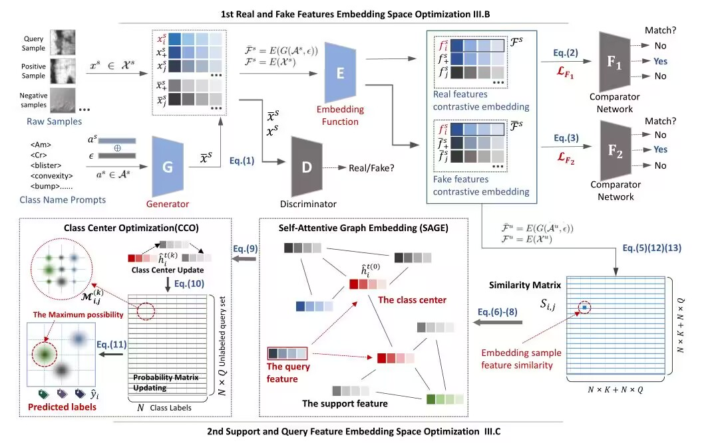
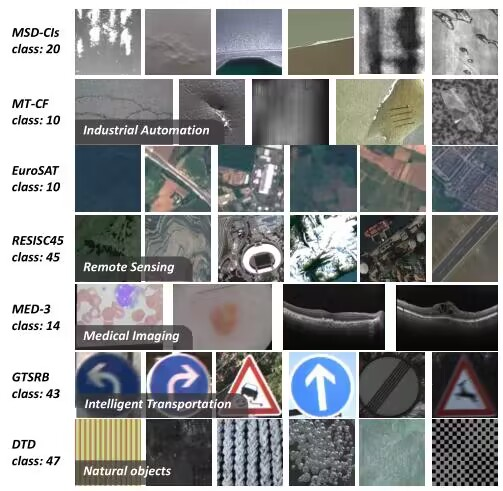

# Generative and Contrastive Combined Support Sample Synthesis Model for Few/Zero-Shot Surface Defect Detection

## Overview
> Surface defect detection is one of the most important vision-based measurements for intelligent manufacturing. Existing detection methods mainly require massive numbers of defect samples to train the model to detect the defects. Nowadays, inadequate defect samples and labels are inevitably encountered in industrial data environments due to the highly automated and stable production lines escalatingly deployed, causing fewer and fewer defective products to be produced.  Consequently, manual interventions are deeply required to analyze the abnormal sample once an unseen defect accidentally emerges that significantly decreases productivity. To this end, this paper proposes a novel few/zero-shot compatible surface defect detection method without requiring massive or even any defect samples to detect surface defects. First, a novel contrastive generator is proposed to use defects' text descriptions to synthesize “fake” visual features for those rare defects. Then, the synthesized visual features (for support samples) are fused with “real” visual features (for query samples) into a similarity graph to align the relationships between support samples and query samples. After, a class center optimization method is proposed to iteratively update the similarity matrix of the graph to obtain the classification probabilities for the query samples. Massive experiments on seven fine-grained datasets show that our method gains an average of +8.29% improvements on few-shot detection tasks and achieves an average of +8.23% improvements on zero-shot detection tasks compared with the state-of-the-art method. Moreover, the proposed method is deployed in a real-world prototype system to evaluate the feasibility and practical implementation.


---
---
## Data Preparation
Download link for processed data:
```
link：https://pan.baidu.com/s/1BiTVl4-TtYeo7quBjAYkAA 
password：6ypy						
```
## Prerequisites
To install all the dependency packages, please run:
```
pip install -r requirements.txt
```
Datasets split, please run:
```
Database folder to place: filelists/[Your database]
Move the datafile to filelists/
python write_dataset_filelist.py
```
First extraction feature, please run:
```
python clip.py
```
To install all the dependency packages, please run:
```
pip install -r requirements.txt
```

## experimental result 
---


## References
We adapt our dataloader classes from the following project:
https://github.com/successhaha/GTnet
