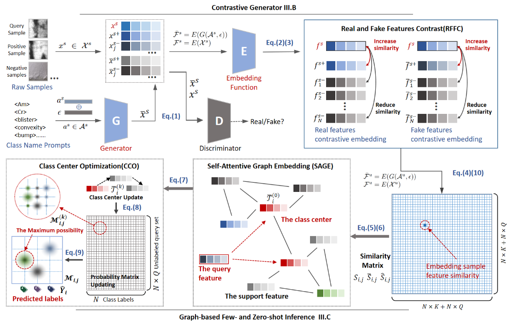

# Twice Embedding Space Optimized for Any-shot Classification Method with Wide Applicability in Several Industrial Fields

## Overview
> Image classification in different industrial fields (industrial automation, remote sensing, medical diagnosis, intelligent transportation, etc.) is important for the optimization of industrial processes. Unlike artificial datasets with a large number of training samples, real industrial data are challenging to collect and have a high cost of data labeling. Therefore, the effective detection of seen and unseen classes by a small number of training samples becomes a key problem in different industrial fields. However, existing few-shot classification methods do not support predicting unseen classes without support samples, while most of the existing zero-shot classification methods are limited to a certain field and have no generalization ability. In summary, there is a need for a model that can be applied in different industrial fields and can recognize seen and unseen classes with a small number of training samples. To this end, this paper proposes a twice-embedding space optimization method for any-shot classification. Firstly, a novel $\mathcal{E}$-GAN model is proposed, which uses class names as prompts to generate fake features of the corresponding classes, and performs 1st embedding space optimization on the synthesized fake and real features. Then, a fused graph of support and query samples is built, and a graph-based center feature update method is proposed for 2nd optimization of the embedding space of query and support samples. We perform experiments on seven datasets from different industrial fields and compare state-of-the-art methods, and our approach obtains significant improvements in the few-shot classification (+4.12\%$\sim$13.65\% improvement on all datasets) and zero-shot classification (+8.23\% average improvement on all datasets for the combined metrics) tasks. Also, the proposed model is deployed on a prototype manufacturing scenario that further demonstrates the applicability of the work. The source code is available at: https://github.com/NDYBSNDY/AsC


---
## Prerequisites
To install all the dependency packages, please run:
```
pip install -r requirements.txt
```

---
## Data Preparation
1) We divide the seven different data sets as follows:
---


2) Classification display of different datasets:
---


3)Download link for processed data:
```
link：https://pan.baidu.com/s/1BiTVl4-TtYeo7quBjAYkAA 
password：6ypy						
```

## References
We adapt our dataloader classes from the following project:
https://github.com/successhaha/GTnet


